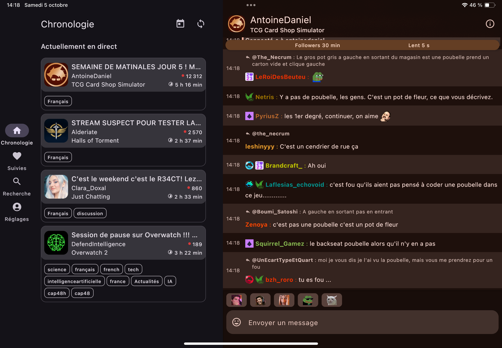

# Just Chatting

An app focused on a great Twitch chat experience.

- iOS and Android support.
- Multi-chat. Open multiple chat bubbles, and switch between them (only on Android.)
- Tablet- and foldable-optimized interface.
- Custom emotes. If the default emotes aren't enough for you, we support third-party emote sets!
- Slide to reply to any message, and see the context of the conversation.
- See your favorite channels' schedule -- past, present, and future, in a unified timeline.

<table>
<tr>
<td>

https://github.com/user-attachments/assets/0f107cee-6294-4fbf-aa15-5466b57a548f

</td>
<td>



</td>
</tr>
</table>

## Project setup

### Android

1. Install [Android Studio](https://developer.android.com/studio/install);
2. Open the project in the IDE.

### iOS

1. Install Xcode 16;
2. Install [Tuist](https://docs.tuist.io/guides/quick-start/install-tuist);
3. Move to the `app-ios` directory, and run `tuist generate` to generate and open the Xcode project.

## Build the project locally
```bash
# Android
./gradlew :app-android:assembleDebug       # Build debug APK
./gradlew :app-android:installDebug        # Install on connected device

# Desktop (JVM)
./gradlew :app-desktop:run                 # Run desktop app

# iOS (requires macOS + Xcode + Tuist)
cd app-ios && tuist generate               # Generate Xcode project, then build in Xcode
```

## Testing

```bash
./gradlew :shared:testDebugUnitTest         # Run shared module unit tests (Android)
./gradlew :konsist-checks:test              # Run architecture validation tests
./gradlew :shared:verifySqlDelightMigration # Validate SQLDelight migrations
```

Unit tests are located in `shared/src/androidUnitTest/kotlin/`.

## Code Formatting

Use **Spotless** with ktlint:

```bash
./gradlew spotlessCheck    # Check formatting
./gradlew spotlessApply    # Auto-format
```

Always run `spotlessApply` before committing. CI enforces formatting on PRs.

## Architecture

This project is a Kotlin Multiplatform app targeting Android, iOS, and JVM desktop. 
The common code (both logic and UI) is included in the `shared` module.

- `app-android` contains the Android-specific code;
- `app-desktop` contains the JVM desktop-specific code;
- `app-ios` contains the iOS-specific code.

Platform-specific code is kept to an absolute minimum.

### Layers (Clean Architecture, enforced by Konsist)

Code is organized by feature under `fr.outadoc.justchatting.feature.*`, with each feature split into:

- **domain** — Business logic, interfaces, use cases. No dependencies on other layers.
- **presentation** — ViewModels, UI state. Depends only on domain.
- **data** — Repositories, API clients, database. Depends only on domain.

### Source Sets (shared module)

- `commonMain` — Cross-platform code (vast majority of logic and UI)
- `androidMain`, `iosMain`, `desktopMain` — Platform-specific implementations
- `skiaMain` — Shared between iOS and Desktop (Skia renderer)
- `appleMain` — Shared Apple platform code

## Main dependencies

- **Compose Multiplatform** — Shared UI across all platforms
- **Koin** — Dependency injection. DI modules in `fr.outadoc.justchatting.di`
- **SQLDelight** — Database. Schema files in `shared/src/commonMain/sqldelight/`
- **Ktor** — HTTP client and WebSocket connections
- **kotlinx-serialization** — JSON serialization
