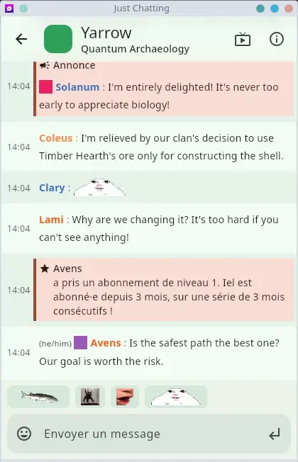
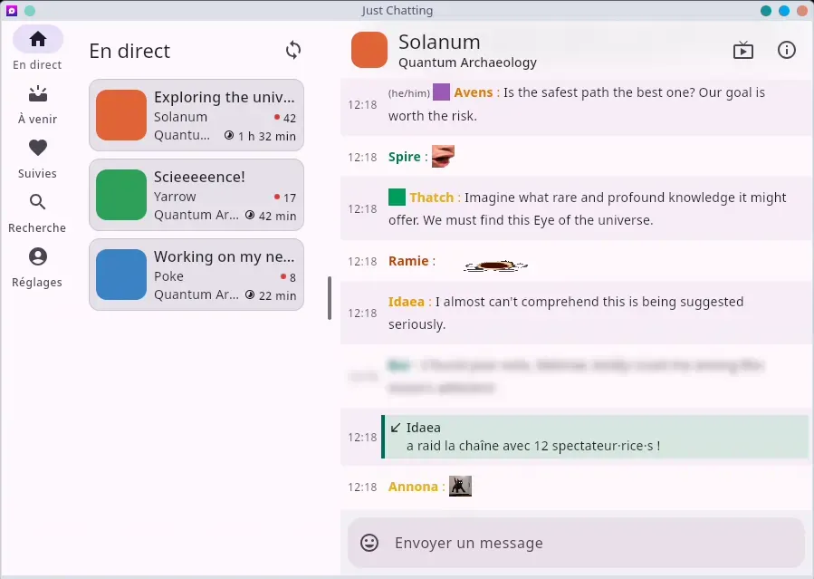

# Just Chatting

An app focused on a great Twitch chat experience.

- Available on **desktop, Android, and iOS** (soon).
- Vibrant Material interface with **dynamic colors** that varies per-stream.
- **Quick emote access**. Your recently-used emotes are always one tap away.
- Multi-chat. Open multiple **chat bubbles**, and switch between them (only on Android.)
- **Tablet- and foldable-optimized** interface.
- **Custom emotes**. If the default emotes aren't enough for you, we support third-party emote sets!
- **Slide to reply** to any message, and see the context of the conversation.
- See your favorite channels' **future schedule**.

<table>
<tr>
<td>



</td>
<td>



</td>
</tr>
</table>

## Download

| Platform | Download |
| --- | --- |
| Android | [](https://play.google.com/store/apps/details?id=fr.outadoc.justchatting) [](https://apps.obtainium.imranr.dev/redirect?r=obtainium://add/https://github.com/outadoc/just-chatting) [](https://github.com/outadoc/just-chatting/releases/latest/download/JustChatting-android.apk) |
| Windows | [](https://github.com/outadoc/just-chatting/releases/latest/download/JustChatting-windows-amd64.msi) |
| macOS | [](https://github.com/outadoc/just-chatting/releases/latest/download/JustChatting-macos-aarch64.dmg) |
| Linux | [](https://github.com/outadoc/just-chatting/releases/latest/download/JustChatting-linux-amd64.AppImage) |
| iOS |  |

## Project setup

### Android

1. Install [Android Studio](https://developer.android.com/studio/install);
2. Open the project in the IDE.

### iOS

1. Install Xcode 16;
2. Install [Tuist](https://docs.tuist.io/guides/quick-start/install-tuist);
3. Move to the `app-ios` directory, and run `tuist generate` to generate and open the Xcode project.

## Build the project locally

```bash
# Android
./gradlew :app-android:assembleDebug       # Build debug APK
./gradlew :app-android:installDebug        # Install on connected device

# Desktop (JVM)
./gradlew :app-desktop:run                 # Run desktop app

# iOS (requires macOS + Xcode + Tuist)
cd app-ios && tuist generate               # Generate Xcode project, then build in Xcode
```

## ABI

Shared modules contain ABI files to precisely control what's exposed publicly to their consumers.
They can be found in the modules' `abi/` directory.

```bash
./gradlew updateKotlinAbi        # Generate ABI files
./gradlew checkKotlinAbi         # Check ABI compatibility
̀```

## Testing

```bash
./gradlew :shared:testDebugUnitTest                  # Run shared module unit tests (Android)
./gradlew :konsist-checks:test                       # Run architecture validation tests
./gradlew :shared-internal:verifySqlDelightMigration # Validate SQLDelight migrations
```

Unit tests are located in `shared/src/androidUnitTest/kotlin/`.

## Code Formatting

Use ktlint:

```bash
./gradlew ktlintCheck    # Check formatting
./gradlew ktlintApply    # Auto-format
```

Always run `ktlintApply` before committing. CI enforces formatting on PRs.

## Architecture

This project is a Kotlin Multiplatform app targeting Android, iOS, and JVM desktop.
The common business logic is included in the `shared` module, and common UI code in `shared-ui`.

Then, by platform:

- `app-android` contains the Android Compose-based application;
- `app-desktop` contains the JVM desktop Compose-based application;
- `app-ios` contains the iOS Compose-based application.
- `app-ios-native` contains the iOS SwiftUI application.

Platform-specific code is kept to an absolute minimum.

### Layers (Clean Architecture, enforced by Konsist)

Code is organized by feature under `fr.outadoc.justchatting.feature.*`, with each feature split
into:

- **domain**: Business logic, interfaces, use cases. No dependencies on other layers.
- **presentation**: ViewModels, UI state. Depends only on domain.
- **data**: Repositories, API clients, database. Depends only on domain.

### Source Sets (shared module)

- `commonMain`: Cross-platform code (vast majority of logic and UI)
- `androidMain`, `iosMain`, `desktopMain`: Platform-specific implementations
- `skiaMain`: Shared between iOS and Desktop (Skia renderer)
- `appleMain`: Shared Apple platform code

## Main dependencies

- **Compose Multiplatform**: Shared UI across all platforms
- **Koin**: Dependency injection. DI modules in `fr.outadoc.justchatting.di`
- **SQLDelight**: Database. Schema files in `shared/src/commonMain/sqldelight/`
- **Ktor**: HTTP client and WebSocket connections
- **kotlinx-serialization**: JSON serialization
