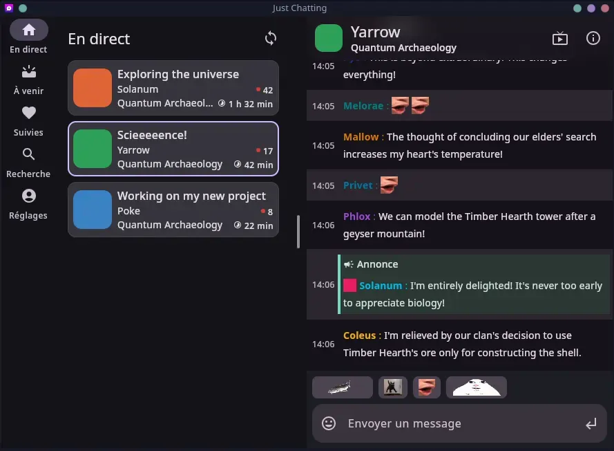

Just Chatting is an app focused on a **great Twitch chat experience**.

- Available on **desktop, Android, and iOS** (soon).
- Vibrant Material interface with **dynamic colors** that vary per-stream.
- **Quick emote access**. Your recently-used emotes are always one tap away.
- **Multi-chat**. Open multiple chat bubbles, and switch between them (only on Android.)
- **Tablet**- and **foldable**-optimized interface.
- **Custom emotes**. If the default emotes aren't enough for you, we support third-party emote sets!
- **Slide to reply** to any message, and see the context of the conversation.
- See your favorite channels' **future schedule**.

## Download

| Platform | Download |
| --- | --- |
| Android |    |
| Windows | [Download .msi](https://github.com/outadoc/just-chatting/releases/latest/download/JustChatting-windows-amd64.msi) |
| macOS | [Download .dmg](https://github.com/outadoc/just-chatting/releases/latest/download/JustChatting-macos-aarch64.dmg) |
| Linux | [Download .AppImage](https://github.com/outadoc/just-chatting/releases/latest/download/JustChatting-linux-amd64.AppImage) |
| iOS | Private TestFlight beta, [request access](https://testflight.apple.com/join/4AAnUWVX) |

See the [GitHub releases page](https://github.com/outadoc/just-chatting/releases/latest) for all available downloads.
